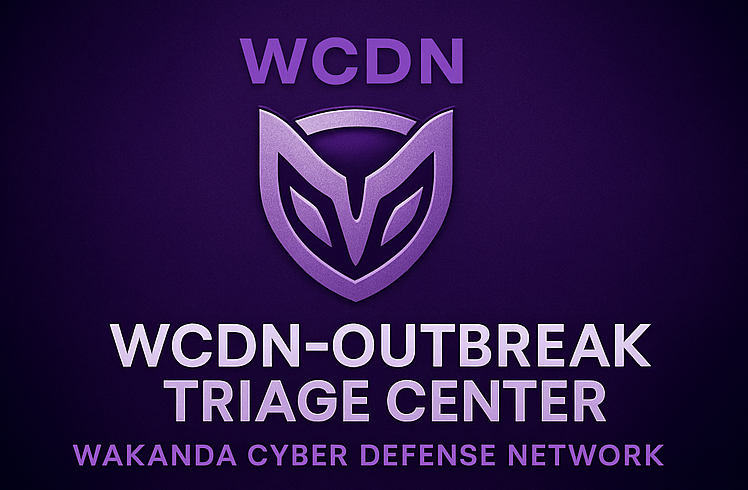

<!-- OPTIONAL: HERO BANNER (upload your own image to /assets first) -->

  

<!-- BADGES -->

  
  
  

 

<!-- MAIN COLORED CARD -->

  <h2 style="color:#e5e7eb; margin-top:0;">🧬 WCDN Outbreak Command Unit</h2>
  

    A full SOC / SIEM incident response operation inside the
    <strong>Wakanda Cyber Defense Network (WCDN)</strong>. This lab focuses on
    <strong>outbreak detection</strong>, <strong>alert triage</strong>,
    <strong>ticketing workflows</strong>, and <strong>cross-team escalation</strong>
    during a simulated cyber pathogen outbreak.
  

  <ul style="color:#e5e7eb; font-size:14px;">
    <li>Maps detections to <strong>MITRE ATT&amp;CK</strong> techniques.</li>
    <li>Uses <strong>Security Hub</strong>, <strong>GuardDuty</strong>, and <strong>CloudTrail</strong> as primary signal sources.</li>
    <li>Emulates real-world SOC runbooks for outbreak triage and containment.</li>
  </ul>

 

<!-- SECONDARY COLORED BLOCKS -->
<table>
  <tr>
    <td style="
      background:#020617;
      border-radius:12px;
      padding:18px;
      border:1px solid #1f2937;
      vertical-align:top;
      width:50%;
    ">
      <h3 style="color:#f97316; margin-top:0;">🧱 Lab Architecture</h3>
      <ul style="color:#e5e7eb; font-size:14px;">
        <li>AWS multi-account setup under <strong>WCDN</strong> org.</li>
        <li>Centralized <strong>Security Hub</strong> and <strong>GuardDuty</strong>.</li>
        <li>Outbreak triage dashboards and findings views.</li>
      </ul>
    </td>
    <td style="
      background:#0b1120;
      border-radius:12px;
      padding:18px;
      border:1px solid #1f2937;
      vertical-align:top;
      width:50%;
    ">
      <h3 style="color:#22c55e; margin-top:0;">🛠️ Tech Stack</h3>
      <ul style="color:#e5e7eb; font-size:14px;">
        <li><strong>AWS Security Hub</strong>, <strong>GuardDuty</strong>, <strong>CloudTrail</strong></li>
        <li><strong>EventBridge</strong> rules for alert routing (if used)</li>
        <li>Ticketing / triage documented in <code>documentation/</code></li>
      </ul>
    </td>
  </tr>
</table>

 

  <h3 style="color:#6ee7b7; margin-top:0;">🚀 How to Use This Lab</h3>
  <ol style="color:#d1fae5; font-size:14px;">
    <li>Review <code>documentation/architecture.md</code> for the outbreak flow.</li>
    <li>Walk through sample findings in <code>documentation/findings/</code>.</li>
    <li>Follow the triage steps in <code>runbooks/</code> to simulate SOC escalation.</li>
  </ol>

# 🛡️ WCDN – Outbreak Triage Center
### SOC Analyst • Incident Triage • Threat Investigation

---

## 🔍 Project Overview
The **Outbreak Triage Center** simulates a multi-account AWS SOC environment where you acted as the **Outbreak Triage Specialist**, responsible for triage workflows, GuardDuty/Config/Security Hub analysis, CloudWatch correlation, and escalation procedures.

---

## 🧠 Skills Demonstrated
- SOC Tier-1 / Tier-2 Triage  
- AWS Security Hub Investigation  
- GuardDuty Analysis  
- IAM Misconfiguration Detection  
- VPC Flow Log Review  
- Ticketing & Escalation Messaging  
- Severity Classification & MITRE Mapping  

---

## 🛠️ Tools & Technologies
**AWS GuardDuty, Security Hub, IAM, CloudTrail, Config, Athena**

---

# 📸 Screenshots
- GuardDuty Findings  
- Security Hub Dashboard  
- CloudTrail Event Logs  
- Ticketing Messages (to SOC Lead)  
- Severity Board / Triage Matrix  

---

# 📘 Documentation
- `documentation/methodology.md`  
- `documentation/findings.md`  
- `reports/executive-summary.pdf`

---

# 🧩 Lessons Learned
- Triage must be structured & repeatable  
- GuardDuty findings require contextual validation  
- IAM permissions directly influence investigation ability  

---

# ⚖️ Ethical Notice
All security analysis was done in a controlled TKH educational AWS environment.

---

# 🏁 Summary
This project reflects the responsibilities of a real SOC analyst conducting cloud-based triage and incident investigation.
